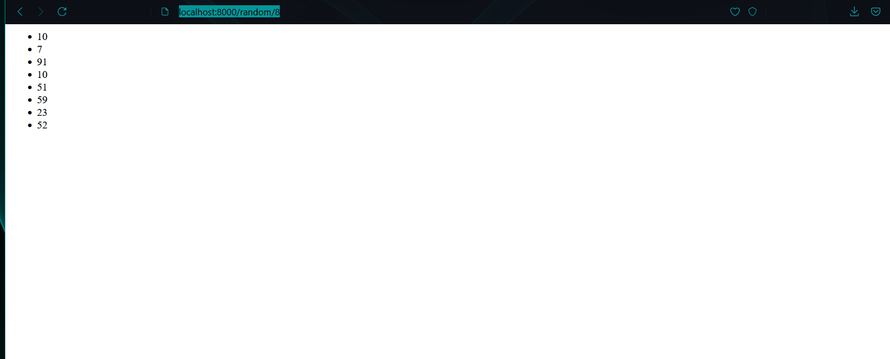
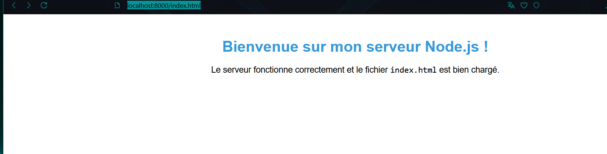
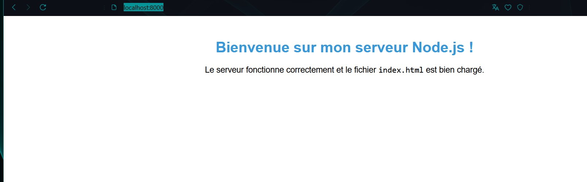
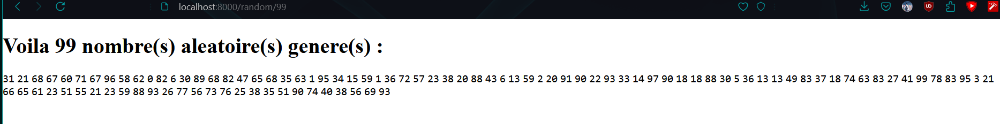
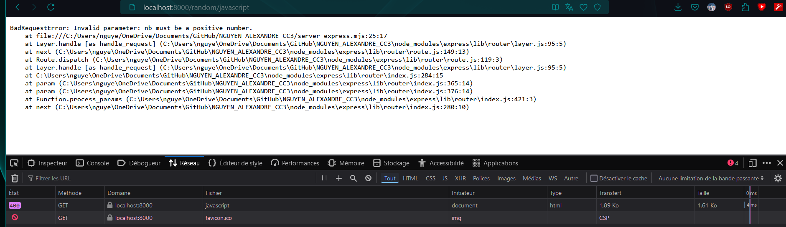
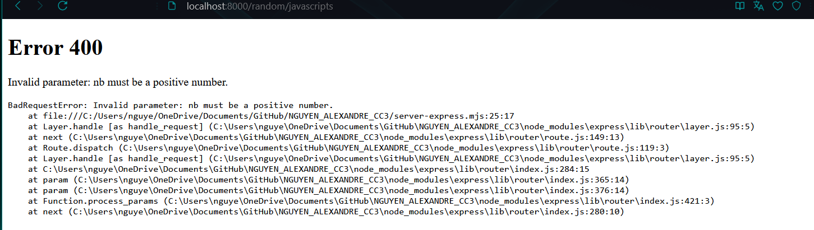
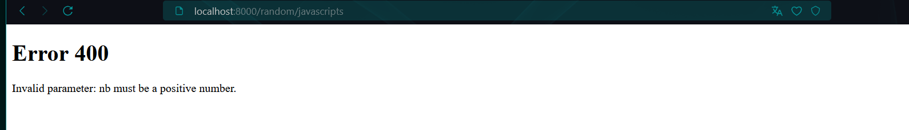
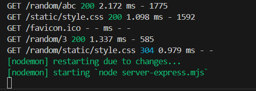
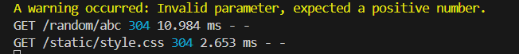

# NGUYEN_ALEXANDRE_CC3

## Question 1.1

Dans cette question, nous avons une fonction `requestListener` qui génère une page HTML simple avec le message **"My first server!"**.  

### En-têtes renvoyés :
```json
{
  "connection": "keep-alive",
  "date": "Wed, 25 Sep 2024 09:38:17 GMT",
  "keep-alive": "timeout=5",
  "transfer-encoding": "chunked"
}
```

Quand cette page est affichée dans un navigateur, le contenu HTML est bien affiché avec "My first server".

---

## Question 1.2

La fonction `requestListener` a été modifiée pour renvoyer une réponse au format JSON. Voici l’en-tête de réponse pour cette fonction :

### En-têtes renvoyés :
```json
{
  "connection": "keep-alive",
  "content-length": "20",
  "content-type": "application/json",
  "date": "Wed, 25 Sep 2024 09:45:53 GMT",
  "keep-alive": "timeout=5"
}
```

La page générée affiche une réponse au format JSON contenant le message :
```json
{ "message": "I'm OK" }
```

---

## Question 1.3

Cette fois, nous essayons de lire un fichier HTML (`index.html`) à l’aide de `fs.readFile()`. Si le fichier est lu avec succès, il est renvoyé au client avec un type de contenu `text/html`. Cependant, une erreur se produit lors de l’appel de `fetch()`, générant un message d’erreur comme suit :

### Message d'erreur :
```
Error fetching headers: TypeError: fetch failed
  at node:internal/deps/undici/undici:13178:13
  at async fetchHeaders (...reponse.js:9:26) {
  [cause]: Error: read ECONNRESET
}
```

Cette erreur est probablement liée à un problème de connexion, le serveur ayant réinitialisé la connexion avant la fin de la lecture.

---

## Question 1.4

L’erreur `ENOENT (No such file or directory)` indique que le fichier `index.html` est introuvable dans le répertoire. La fonction essaie de lire un fichier qui n'existe pas.

---

## Question 1.5

Comparaison entre deux versions de la fonction `requestListener` pour gérer la lecture asynchrone du fichier `index.html` :

### Sans `async` :
Cette version utilise une promesse via `.then()` et `.catch()` pour lire le fichier et envoyer une réponse. Si une erreur survient, un message "Internal Server Error" est renvoyé avec un code 500.

```javascript
function requestListener(_request, response) {
  fs.readFile("index.html", "utf8")
    .then((contents) => {
      response.setHeader("Content-Type", "text/html");
      response.writeHead(200);
      response.end(contents);
    })
    .catch((error) => {
      console.error(error);
      response.writeHead(500, { "Content-Type": "text/plain" });
      response.end("Internal Server Error");
    });
}
```

### Avec `async` :
Ici, la fonction utilise `await` pour attendre la lecture du fichier, simplifiant la gestion des promesses. En cas d'erreur, la gestion est similaire avec un statut 500 et un message "Internal Server Error".

```javascript
// Fonction asynchrone qui gère les requêtes et envoie des réponses
async function requestListener(_request, response) {
  try {
      // Lecture du fichier "index.html" de manière asynchrone avec l'encodage "utf8"
      const contents = await fs.readFile("index.html", "utf8");
      
      // Définir l'en-tête de la réponse pour indiquer que le contenu est du HTML
      response.setHeader("Content-Type", "text/html");
      
      // Envoyer un statut HTTP 200 pour indiquer que la requête a été traitée avec succès
      response.writeHead(200);
      
      // Envoyer le contenu du fichier "index.html" dans la réponse et terminer la réponse
      response.end(contents);
  } catch (error) {
      // Si une erreur survient lors de la lecture du fichier, l'erreur est affichée dans la console
      console.error(error);
      
      // Envoyer un statut HTTP 500 pour indiquer une erreur interne du serveur
      response.writeHead(500, { "Content-Type": "text/plain" });
      
      // Terminer la réponse avec un message d'erreur simple
      response.end("Internal Server Error");
  }
}

```

---

## Question 1.6

Ces commandes ont ajouté deux packages dans le projet :

- **cross-env** : pour démarrer le projet en mode production.
- **nodemon** : pour faciliter le développement en redémarrant automatiquement le serveur après chaque modification.

Cela a également rajouté le dossier `node_modules` dans le dossier `NGUYEN_ALEXANDRE_CC3`.

---

## Question 1.7

La principale différence entre les modes production et développement est que le mode production est le mode par défaut avec Node.js, tandis que le mode développement, avec nodemon, permet de détecter automatiquement les changements de fichiers et de redémarrer le serveur sans intervention manuelle. Cela rend le processus de développement beaucoup plus fluide et rapide.

La grande différence est donc le redémarrage automatique lors d'un changement détecté, permettant un développement beaucoup plus fluide.

---

## Question 1.8

Analyse des codes HTTP renvoyés par différentes routes :

- **http://localhost:8000/index.html** : `200 (OK)`
  - Le fichier `index.html` a été trouvé et renvoyé avec succès.

- **http://localhost:8000/random.html** : `200 (OK)`
  - Une page avec un nombre aléatoire a été renvoyée avec succès.

- **http://localhost:8000/** : `404 (Not Found)`
  - La route n’est pas définie dans le switch et renvoie une erreur 404.

- **http://localhost:8000/dont-exist** : `404 (Not Found)`
  - La route est inconnue, d'où une erreur 404.


---

### Fonction pour générer un nombre aléatoire en fonction d'un paramètre :
```javascript
async function requestListener(request, response) {
  response.setHeader("Content-Type", "text/html");
  
  try {
    const pathParts = request.url.split("/");

    switch (pathParts[1]) {
      case "":
      case "index.html":
        response.writeHead(200);
        return response.end(await fs.readFile("index.html", "utf8"));

      case "random.html":
        response.writeHead(200);
        return response.end(`<html><p>${Math.floor(100 * Math.random())}</p></html>`);

      case "random":
        const nb = parseInt(pathParts[2]);
        if (!isNaN(nb) && nb > 0) {
          let randomNumbers = "";
          for (let i = 0; i < nb; i++) {
            randomNumbers += `<p>${Math.floor(100 * Math.random())}</p>`;
          }
          response.writeHead(200);
          return response.end(`<html>${randomNumbers}</html>`);
        } else {
          response.writeHead(400);
          return response.end(`<html><p>400: BAD REQUEST</p></html>`);
        }

      default:
        response.writeHead(404);
        return response.end(`<html><p>404: NOT FOUND</p></html>`);
    }
  } catch (error) {
    console.error(error);
    response.writeHead(500);
    return response.end(`<html><p>500: INTERNAL SERVER ERROR</p></html>`);
  }
}
```

---

## Question 2.1

URL des documents de chaque modules :

Express : **https://expressjs.com/**

http-errors : **https://www.npmjs.com/package/http-errors**

loglevel : **https://www.npmjs.com/package/loglevel**

Morgan (HTTP request logger middleware) : **https://www.npmjs.com/package/morgan**

---

## Question 2.2

Verification des liens :

**http://localhost:8000/random/8**: 


**http://localhost:8000/index.html**:


**http://localhost:8000/**:


On a bien les trois liens qui fonctionnement en utilisant la commande npm run express-dev pour le mode developpement

---

## Question 2.3

dans le cas de 'http://localhost:8000' et 'http://localhost:8000/index.html' :

### En-têtes renvoyés :
```json
{
  "accept-ranges": "bytes",
  "cache-control": "public, max-age=0",
  "connection": "keep-alive",
  "content-length": "621",
  "content-type": "text/html; charset=UTF-8",
  "date": "Wed, 25 Sep 2024 23:31:21 GMT",
  "etag": "W/\"26d-1922b6cadfc\"",
  "keep-alive": "timeout=5",
  "last-modified": "Wed, 25 Sep 2024 23:03:15 GMT",
  "x-powered-by": "Express"
}
```
si on compare avec ceux dans http , on a ducoup quelque entete de rajouter comme :
* x-powered-by :
     qui est propre a Express et indique que la réponse est générée par Express.
* etag et last-modified : 
     qui meme si ils sont egalement dans les reponses http , leur gestion est souvent simplifiee et automatique dans Express.
* cache-control:
     gestion de la mise en cache qui peut être plus explicite dans Express par rapport à des configurations HTTP plus basiques.


dans le cas de 'http://localhost:8000/random/8 (avec 8 un nombre):

### En-têtes renvoyés :
```json
{
  "connection": "keep-alive",
  "content-length": "114",
  "content-type": "text/html; charset=utf-8",
  "date": "Thu, 26 Sep 2024 00:21:02 GMT",
  "etag": "W/\"72-A0G2VYysQYvLcQKqN7JUeDoBkmE\"",
  "keep-alive": "timeout=5",
  "x-powered-by": "Express"
}
```

on a une differente valeur de content-length avec bien  le x-powered-by present.

---

## Question 2.4

Listening est déclenché dans un serveur node ( dans ce cas en Express) lorsque le serveur commence a écouter sur le port specifié dans ce cas la le port 8000. listening est déclenché lorsque le serveur est prêt à accepter des connexions apres s'être lié avec succès a l'adresse et au port spécifiés. Cela permet aux développeurs de savoir quand le serveur est opérationnel et prêt à traiter des requêtes.

---

## Question 2.5

l'option qui redirige / vers /index.html est express.static qui sert de maniere automatique le fichier index.html lorsque on accede à la racine d'un dossier contenant ce fichier.Lorsque on utilises ```json app.use(express.static("static")); ```, Express cherche un fichier nommé   index.html dans le dossier spécifié dans ce cas la le dossier static. Si ce fichier existe et que l'utilisateur accède à la racine (/), Express renverra automatiquement le fichier index.html.


## Question 2.6

On a plusieurs codes possibles quand on regarde le fichier `style.css` :

* **Lorsque l'on visite le site pour la première fois (F5 première visite)** :
    - **Code HTTP** : 200 (OK)
    - **Explication** : Lors de la première visite, le fichier `style.css` est téléchargé depuis le serveur car il n'est pas encore en cache. Le serveur renvoie donc un code 200 OK pour indiquer que le fichier a été servi avec succès.

* **Lorsqu'on fait un rafraîchissement normal (Ctrl + R)** :
    - **Code HTTP** : 304 Not Modified (si le fichier est en cache) ou 200 OK (si le cache a expiré)
    - **Explication** :
      - Si le fichier `style.css` est déjà en cache et n'a pas changé depuis la dernière visite, le navigateur envoie une requête conditionnelle avec l'en-tête `If-Modified-Since`. 
      - Si le serveur confirme que le fichier n'a pas été modifié, il renvoie 304 Not Modified, indiquant au navigateur d'utiliser la version en cache.
      - Si le fichier a changé ou n'est pas en cache, il renvoie un 200 OK avec le fichier.
      - Après un **hard refresh** (Ctrl + Shift + R), un simple rafraîchissement (Ctrl + R) renverra un code 304 si le fichier n'a pas changé.

* **Lorsqu'on fait un rafraîchissement forcé (Ctrl + Shift + R)** :
    - **Code HTTP** : 200 (OK)
    - **Explication** : Un rafraîchissement forcé ignore complètement le cache, ce qui oblige le navigateur à recharger toutes les ressources à partir du serveur, y compris `style.css`. Le serveur renvoie alors 200 OK pour indiquer que le fichier a été servi à nouveau.

---

**En conclusion** : Lorsqu'on fait un rafraîchissement normal après un rafraîchissement forcé, on passe d'un code 200 à un code 304 si le fichier `style.css` n'a pas été modifié.

---

## Rendu avec EJS

On rajoute cette partie dans server-express.mjs :
```javascript
  const numbers = Array.from({ length })
   .map(() => Math.floor(100 * Math.random()));
  
  const welcome = `Voila ${length} nombre(s) aleatoire(s) genere(s) :`;

  return response.render("random", { numbers , welcome});
```
Ce qui nous permettra d'afficher a la fois un message welcome et une suite de nombre en fonction du nombre données en url

Voici le resultat:


---

## Gestion d'erreurs Part 1

Apres avoir installer http-errors , on import celui ci avec ```javascript
import createError from "http-errors"; ``` , puis on rajoute un if pour verifier si nb est bien un int :
```javascript
  const length = Number.parseInt(request.params.nb , 10);
  if (Number.isNaN(length)|| length <= 0 ) {
    return next(createError(400,'Invalid parameter: nb must be a positive number.'));
  }
```
On a bien alors une erreur 400 montrant que nb est different d'un int :


## Question 2.7

On insere les deux handlers pour gerer les erreurs et on a bien deux type d'affichage de l'erreur :

En mode Developpement : `npm run express-dev`


On a la pile d'appels ( le stack ) present dans la page d'erreur , utile pour les developpeur.

En mode Production : `npm run express-prod`


En production , la pile d'appels n'est pas afficher uniquement le code d'erreur est affiche ainsi que le message d'erreur.

---

## Configuration de LOGGER

On mets le niveau du log a warn avec : `logger.setLevel(logger.levels.WARN);` , et on voit ce que on a dans le terminal , si nb est bien un int , pas d'erreur est afficher ,  mais si on a une erreur , ce message devrait apparetre `logger.warn("A warning occurred: Invalid parameter, expected a positive number.");`, pour dire que l'on a une erreur.

WARN sans erreur: 


pas d'erreur rencontrer , rien est afficher.

WARN avec une erreur:

    
on a la une erreur donc le log warn est afficher en jaune pour montrer l'importance de l'erreur.


---